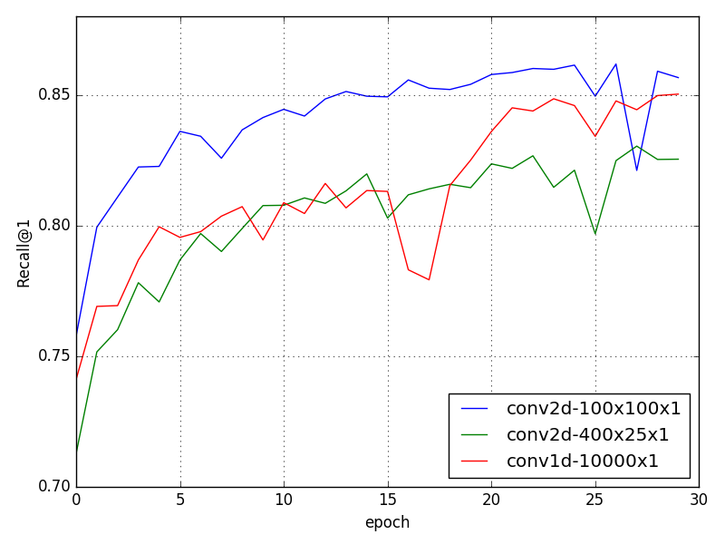
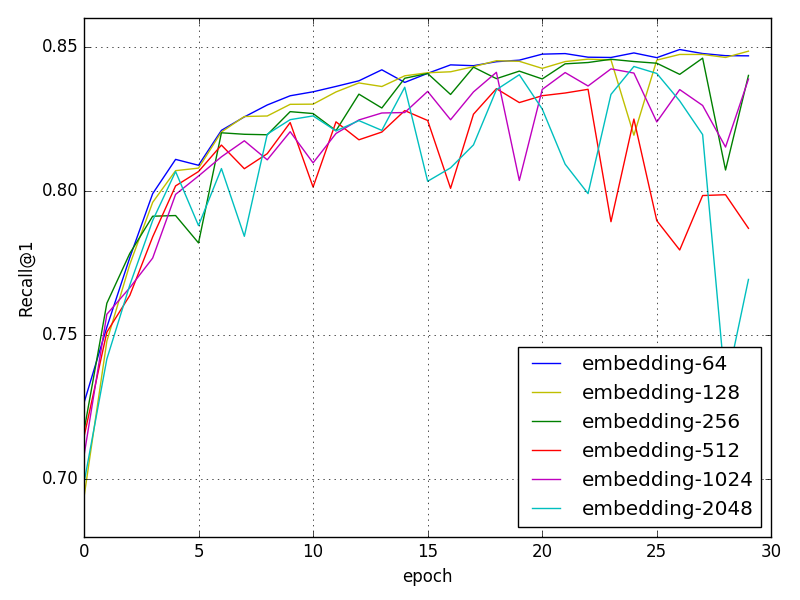
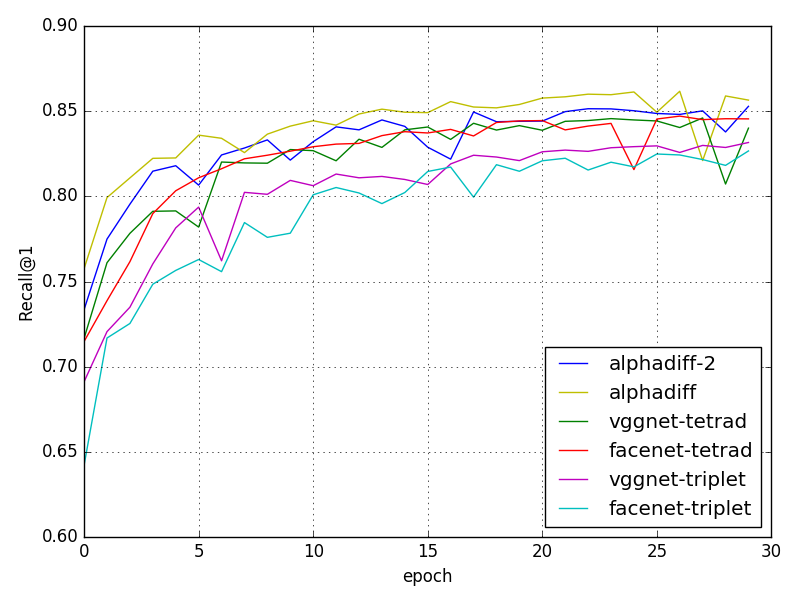
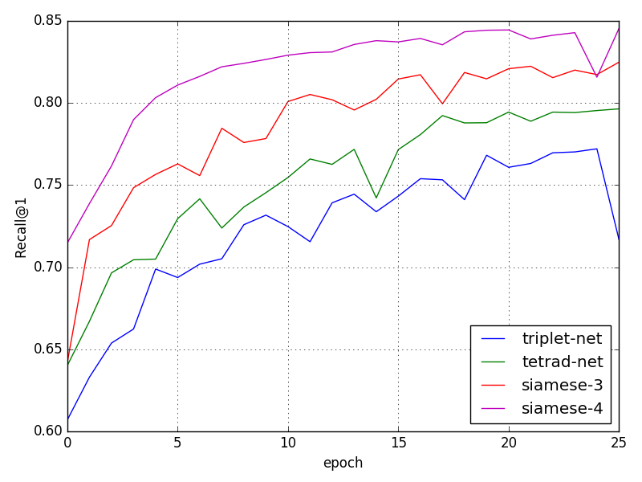
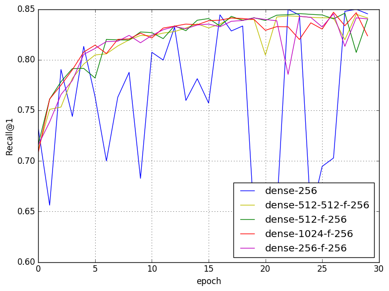

This page is used as a supplementary web page for paper "αDiff: Cross-Version Binary Code Similarity Detection with DNN" (ASE '18).

### ACM Reference Format

    Bingchang Liu, Wei Huo, Chao Zhang, Wenchao Li, Feng Li, Aihua Piao, Wei Zou.2018. αDiff:Cross-Version Binary Code Similarity Detection with DNN. In Proceedings of the 2018 33rd ACM/IEEE International Conference on Automated Software Engineering (ASE ’18), September 3–7, 2018, Montpellier, France.ACM,NewYork,NY,USA,12pages.https://doi. org/10.1145/3238147.3238199

# CNN Structure

**Table I**: Structure of our CNN. The output shapes are described in 
**rows** _x_ **cols** _x_ **filters**. The kernel is specified as
 **rows** _x_ **cols** _x_ **rowstride** _x_ **colstride** .
 The input shape is *100x100x1* and output embedding is 64-dimensional.

|Layer |Kernel | Output shape | Param#
|:------- | :--------- | :--------- | -----------:
|input_1 | | 100x100x1 | 0
|conv2d_1 | 3x3x1x1 | 100x100x32 | 320 
|batch_normalization_1 | | 100x100x32 | 128
|activation_1 | | 100x100x32 | 0 
|conv2d_2 | 3x3x1x1 | 100x100x32 | 9248
|batch_normalization_2 | | 100x100x32 | 128 
|activation_2 | | 100x100x32 | 0 
|average_pooling2d_1 | 2x2x2x2 | 50x50x32 | 0 
|conv2d_3 | 3x3x1x1 | 50x50x64 | 18496 
|batch_normalization_3 | | 50x50x64 | 256 
|activation_3 | | 50x50x64 | 0 
|conv2d_4 | 3x3x1x1 | 50x50x64 | 36928 
|batch_normalization_4 | | 50x50x64 | 256 
|activation_4 | | 50x50x64 | 0 
|average_pooling2d_2 | 2x2x2x2 | 25x25x64 | 0 
|conv2d_5 | 3x3x1x1 | 25x25x96 | 55392 
|batch_normalization_5 | | 25x25x96 | 384 
|activation_5 | | 25x25x96 | 0 
|conv2d_6 | 3x3x1x1 | 25x25x96 | 83040 
|batch_normalization_6 | | 25x25x96 | 384
|activation_6 | | 25x25x96 | 0 
|average_pooling2d_3  | 2x2x2x2 | 12x12x96 | 0 
|conv2d_7 | 3x3x1x1 | 12x12x96 | 83040 
|batch_normalization_7 | | 12x12x96 | 384 
|activation_7 | | 12x12x96 | 0 
|conv2d_8 | 3x3x1x1 | 12x12x96 | 83040 
|batch_normalization_8  | | 12x12x96 | 384 
|activation_8 | | 12x12x96 | 0 
|average_pooling2d_4  | 2x2x2x2 | 6x6x96 | 0 
|dense_1 | | 6x6x512 | 49664 
|flatten_1 | | 18432 | 0 
|dense_2 | | 64 | 1179712 
|**Total params:**| | | **1,601,184** 
|**Trainable params:**| | | **1,600,032**
|**Non-trainable params:**| | | **1,152**

<!-- 
;# Convolutional Network Type & Input Tensor Shape: 1D-vs-2D
;
;
;# Hyper-parameters
;
;## Embedding Size
;
;
;## Hard Negative sample Mining Method
;
;
;# Deep Neural Network
;
;# Architecute
;
;
;# Dense Layers
; 
-->
